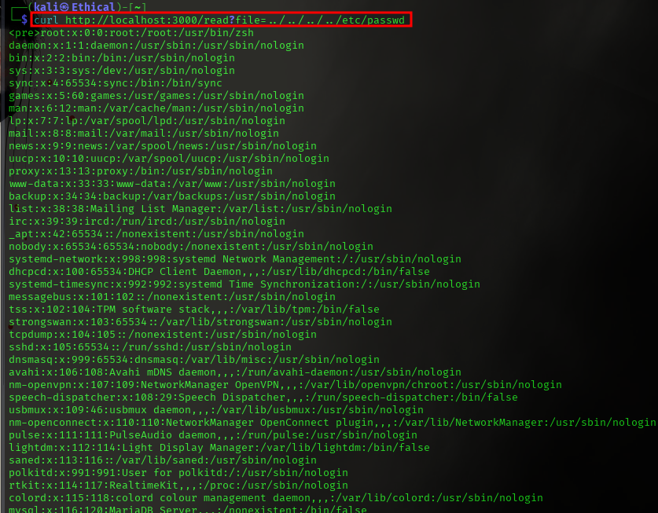

# 🚀 Projet LFI - Local File Inclusion Exploitation & Protection

## 📌 Description
Ce projet démontre à la fois l'exploitation et la sécurisation de la vulnérabilité **Local File Inclusion (LFI)** dans une application web. Il comprend un serveur vulnérable (`server.js`) et une version sécurisée (`server-secure.js`), permettant aux étudiants d'apprendre les risques de LFI et les bonnes pratiques pour s'en protéger.

## 📁 Structure du projet
```
├── index.html               # Page d'accueil
├── interface.html           # Interface de test pour la vulnérabilité LFI
├── node_modules/            # Dépendances Node.js
├── package.json             # Configuration des dépendances
├── package-lock.json        # Fichier de verrouillage des versions
├── safe_files/              # Dossier sécurisé pour les fichiers accessibles
│   ├── robots.txt           # Contient les infos sur la formation et le formateur
├── server.js                # Serveur vulnérable à LFI
├── server-secure.js         # Serveur sécurisé bloquant l'exploitation LFI
└── README.md                # Documentation du projet
```

## ⚠️ Serveur vulnérable (`server.js`)
Ce serveur ne filtre pas les entrées utilisateur, permettant l'inclusion de fichiers arbitraires via l'URL :
```
http://localhost:3000/read?file=../../etc/passwd
```
### 💀 Exemples d'attaques possibles :
- Accès aux fichiers sensibles (`/etc/passwd`, `C:\windows\system32\drivers\etc\hosts`)
- Récupération du code source de l'application
- Accès à des journaux et autres informations confidentielles

## 🔒 Serveur sécurisé (`server-secure.js`)
Cette version implémente des protections contre l'exploitation LFI :
- **Restriction des fichiers accessibles** (uniquement dans `safe_files/`)
- **Blocage des chemins relatifs (`../` ou `/`)**
- **Validation des fichiers demandés**

### ✅ Exemple d'accès sécurisé :
```
curl "http://localhost:3000/read?file=robots.txt"
```
Seulement les fichiers dans `safe_files/` sont accessibles.

## 🚀 Installation et exécution
1. **Installer les dépendances** :
```
npm install
```
2. **Lancer le serveur vulnérable** :
```
node server.js
```
3. **Lancer le serveur sécurisé** :
```
node server-secure.js
```

## 📧 Contact
**Formateur :** GOMPOU TIA ANGE  
**Spécialisation :** Offensive Security | Full Stack PHP Developer  
**Email :** tiaange03@gmail.com

---
**📢 Note :** Ce projet est destiné à un usage éducatif uniquement. Ne pas utiliser à des fins illégales !


